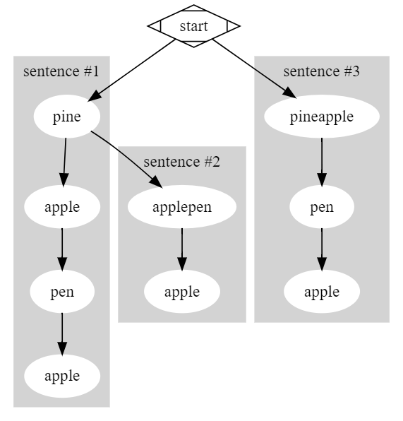

# 问题
[140. Word Break II.md](https://leetcode.com/problems/word-break-ii/)

Given a non-empty string s and a dictionary wordDict containing a list of non-empty words, add spaces in s to construct a sentence where each word is a valid dictionary word. Return all such possible sentences.

Note:

- The same word in the dictionary may be reused multiple times in the segmentation.
- You may assume the dictionary does not contain duplicate words.

Example 1:
```
Input:
s = "catsanddog"
wordDict = ["cat", "cats", "and", "sand", "dog"]
Output:
[
  "cats and dog",
  "cat sand dog"
]
```

Example 2:
```
Input:
s = "pineapplepenapple"
wordDict = ["apple", "pen", "applepen", "pine", "pineapple"]
Output:
[
  "pine apple pen apple",
  "pineapple pen apple",
  "pine applepen apple"
]
Explanation: Note that you are allowed to reuse a dictionary word.
```

Example 3:
```
Input:
s = "catsandog"
wordDict = ["cats", "dog", "sand", "and", "cat"]
Output:
[]
```

# 难度
✳✳✳

# 解答
- 深度优先递归解法
[C++ Code](./code/140.Word-Break-II/DfsSolution.cpp)
```cpp
std::vector<std::string> DfsSolution::wordBreak(const std::string& words, const std::vector<std::string>& wordDict)
{
   return getPossibleSentences(words, wordDict);
}

std::vector<std::string> DfsSolution::getPossibleSentences(const std::string& subWords, const std::vector<std::string>& wordDict)
{
   if (sentencesMap.count(subWords) > 0) return sentencesMap.at(subWords);
   if (subWords.empty()) return { "" };

   std::vector<std::string> sententences;
   for (const auto& word : wordDict)
   {
      if (subWords.rfind(word, 0) == 0)
      {
         for (const auto appendSentence : getPossibleSentences(subWords.substr(word.size()), wordDict))
         {
            auto sentence = word + (appendSentence.empty() ? "" : " ") + appendSentence;
            sententences.push_back(sentence);
         }
      }
   }

   sentencesMap.insert(std::pair<std::string, std::vector<std::string>>(subWords, sententences));

   return sententences;
}
```

- 动态规划解法
[C++ Code](./code/140.Word-Break-II/DpSolution.cpp)
```cpp
std::vector<size_t> DpSolution::getTailPositions
(
   const std::string::const_iterator begin,
   const std::string::const_iterator end,
   const std::vector<std::string>& wordDict
)
{
   std::vector<size_t> tailPositions;
   const std::string word(begin, end);

   for (auto&& tail : wordDict)
   {
      if (word.size() >= tail.size())
      {
         size_t len = tail.size();
         size_t pos = word.size() - tail.size();

         if (word.compare(pos, len, tail) == 0)
         {
            tailPositions.push_back(pos);
         }
      }
   }

   return tailPositions;
}

std::vector<std::string> DpSolution::wordBreak(const std::string& words, const std::vector<std::string>& wordDict)
{
   // @TODO: To make the algorithm more efficient, check whether the string can be broken correctly
   // in advance using "139. Word Break" way.
   // For example, s = "aaaaaaaaaaaaaba", wordDist = ["a", "aa", "aaa"], cannot be broken correctly.
   // If we don't check in advance, following code may take too long to solve the problem which may
   // cause "leetcode" to report time limit error.

   typedef std::vector<std::vector<std::string>> SentenceTable;

   SentenceTable sentenceTable(words.size());

   for (size_t i = 0; i < words.size(); i++)
   {
      const auto tailPositions = getTailPositions(words.begin(), words.begin() + i + 1, wordDict);

      for (const auto& tailPosition : tailPositions)
      {
         if (tailPosition == 0)
         {
            sentenceTable[i].push_back(std::string(words.begin(), words.begin() + i + 1));
         }
         else
         {
            for (auto sentence : sentenceTable[tailPosition - 1])
            {
               sentence.push_back(' ');
               sentence.append(std::string(words.begin() + tailPosition, words.begin() + i + 1));
               sentenceTable[i].push_back(sentence);
            }
         }
      }
   }

   return sentenceTable.back();
}
```

# 分析
## 考点
* DFS（深度优先）
* 动态规划

## 难点
* DFS<br>
以如下举例:
```
Input:
s = "pineapplepenapple"
wordDict = ["apple", "pen", "applepen", "pine", "pineapple"]
Output:
[
  "pine apple pen apple",
  "pineapple pen apple",
  "pine applepen apple"
]
Explanation: Note that you are allowed to reuse a dictionary word.
```
将结果用树的形式展示如下：<br>


递归返回当前字符串所有单词组合。为了提高递归算法的效率，通过一个Hash Map存储所有字符串的所有单词的组合。因此，递归条件可以通过查找当前字符串是否已经在Hash Map中，实现提前结束。

* 动态规划<br>
此算法维护了一个大表格去存储各字符字串所有单词的组合。因此，效率无法满足leetcode的要求。但是，可以先检查此字符串是否能实现"word break" (可以通过"139.Word-Break.md"中的方法)，以满足leetcode的检查。

# 扩展
## 相关问题
* [139. Word Break](139.Word-Break.md)
